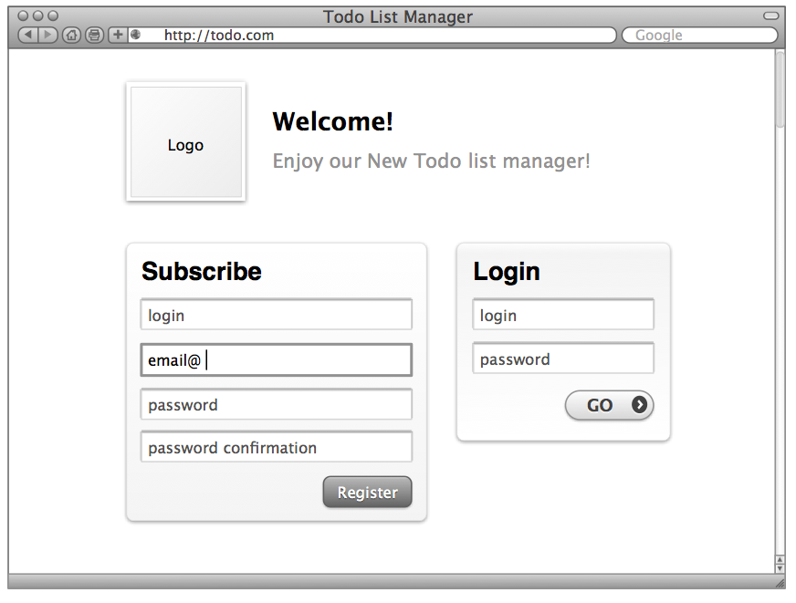
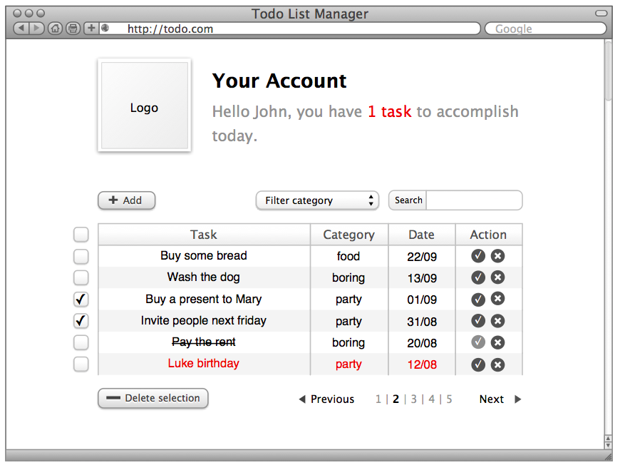
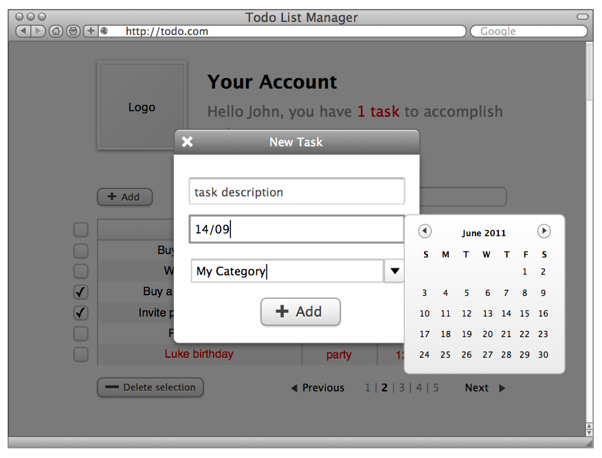
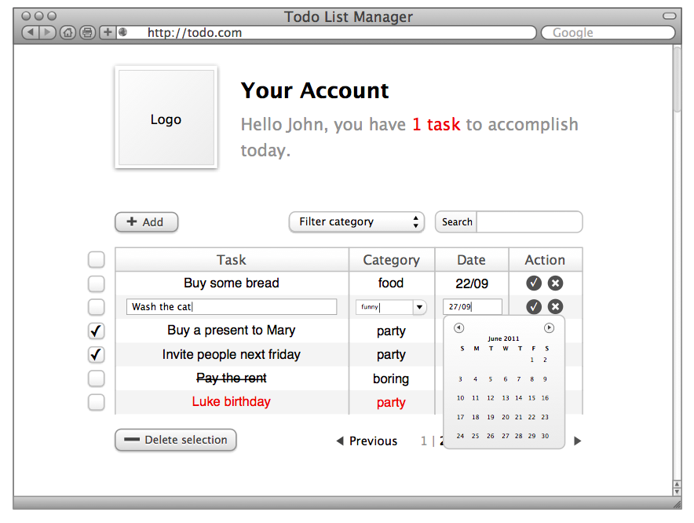
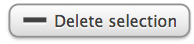
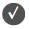

# Todo List

### Introduction

Le but de cet exercice est de réaliser une application web permettant à des utilisateurs enregistrés de gérer facilement une liste de tâches à effectuer.

## Ressources

L'application doit être réalisée avec le framework Ruby on Rails, de préférence la dernière version. La base de données mise en place est de préférence [MongoDB](http://www.mongodb.org/).

✭ [mongoid](https://github.com/mongoid/mongoid) est un bon ORM pour MongoDB.

L'interface est réalisée en HTML / CSS avec le kit [Bootstrap](http://getbootstrap.com/) ou tout autre framework CSS qui vous paraît approprié.

✭ [rails_layout](https://github.com/RailsApps/rails_layout) est une solution pour installer des frameworks CSS dans Rails.

Les interactions de l'utilisateur avec l'interface sont gérées autant que possible avec jQuery.

## Fonctionnel

#### Page d'accueil

La page d'accueil permet à un visiteur de s'inscrire ou de se connecter à l'application.

✭ [devise](https://github.com/plataformatec/devise) est une gem gérant un système d'authentification.

#### Gestion des tâches

Une fois connecté, l'utilisateur peut gérer sa liste de tâches :

* Trier les tâches par date (en cliquant sur les entêtes de colonnes)
* Filtrer les tâches par catégorie
* Rechercher une tâche
* Les tâches sont organisées par page de 20.

✭ [will_paginate](https://github.com/mislav/will_paginate) est une librairie de pagination.

#### Ajouter une tâche

Un cliquant sur le bouton d'ajout, une pop-in contenant le formulaire d'ajout apparait. Lorsque le champ "date" acquiert le focus, un calendrier apparait pour faciliter la saisie à l'utilisateur.

Lorsque la saisie commence dans le champ catégorie, des suggestions de catégories apparaissent (auto-completion).

✭ [rails4-autocomplete](https://github.com/peterwillcn/rails4-autocomplete) gère un système d'autocomplétion, basé sur jQuery.

Si la catégorie saisie n'existe pas, elle est ajoutée. Les catégories sont propres à chaque utilisateur.

La sauvegarde des modifications est réalisée en AJAX.

La pop-in disparait, le tableau en arrière plan se rafraîchit en AJAX avec les nouvelles données.

Les tâches en rouge sont considérées comme en retard ou à effectuer aujourd'hui.

#### Éditer une tâche

Lors du double-clic sur une ligne du tableau, il devient possible d'éditer les informations. La mécanique reste identique au formulaire d'ajout.
La sauvegarde est réalisée en AJAX.

#### Supprimer une ou plusieurs tâches

Il est possible de supprimer les tâches une par une via le bouton  ou en groupe via le bouton .

La suppression est réalisée en AJAX.

#### Marquer une tâche comme effectuée

Le bouton  permet de marquer une tâche comme effectuée.

#### Ajouter une catégorie

Lors de l'ajout ou de l'édition d'une tâche, si une catégorie n'existe pas, elle est ajoutée à la base de données.

#### Supprimer une catégorie

Lors de l'ajout ou de l'édition d'une tâche, si une catégorie ne contient plus aucunes tâches, elle est supprimée de la base de données.

### Instructions complémentaires

Les mockups fournis sont là à titre d'exemple et ne sont pas nécessairement exhaustifs, vous êtes libres de les adapter à votre convenance.

Les liens précisés avec ✭ sont des outils qui peuvent vous aider à réaliser l'application, mais vous pouvez très bien en utiliser d'autres, voire écrire les vôtres.

### Références

* [RailsGuides, la doc officielle très bien faîte](http://guides.rubyonrails.org/getting_started.html)
* [Ruby on Rails tutorial by Michael Hartl](http://www.railstutorial.org/book)
* [Un post sur AJAX et Rails](http://www.codebeerstartups.com/2012/12/ajaxify-your-site-with-remote-true)